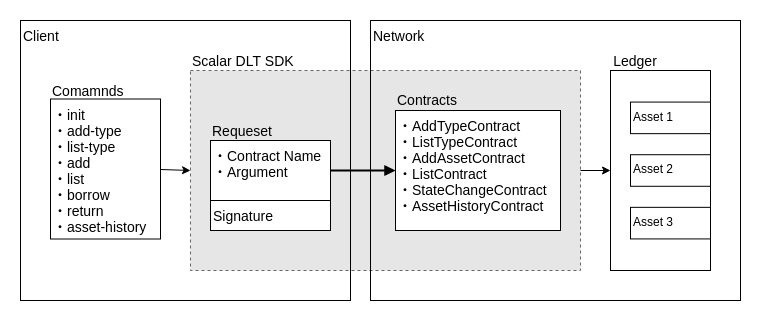

# Write your first Scalar DLT application

- [Write your first Scalar DLT application](#write-your-first-scalar-dlt-application)
  - [Overview](#overview)
    - [Asset management application](#asset-management-application)
  - [Use Scalar DL Client SDK](#use-scalar-dl-client-sdk)
    - [Implement contracts](#implement-contracts)
      - [Read data from the ledger](#read-data-from-the-ledger)
      - [Write data to the ledger](#write-data-to-the-ledger)
      - [Look up data history](#look-up-data-history)
      - [Test your contract implementation](#test-your-contract-implementation)
        - [Unit Test](#unit-test)
          - [Mock the ledger object](#mock-the-ledger-object)
          - [Assert the result of execution](#assert-the-result-of-execution)
        - [Use Scalar DL Emulator](#Use-Scalar-DL-Emulator)
    - [Develop client (application)](#Develop-client-application)
      - [Register certificate](#register-certificate)
      - [Register a contract](#register-a-contract)
      - [Execute a contract](#Execute-a-contract)
      - [Validate ledger data integrity](#Validate-ledger-data-integrity)

In this tutorial we introduce how to implement a simple asset management application on Scalar DLT solution.
If you haven't tried this application yet, please refer to [here](./manual/README.md).

## Overview

Scalar DLT is a distributed ledger platform.
A Scalar DL network exposes a key-value semantics called ledger to clients.
Clients can register digitally-signed programs called contracts, which can create, read and update records in a ledger, and later on send requests to the network to execute registered contracts.

The authentication, confidentiality and integrity is based on PKI.
Ledger data stored in the network is tamper-evident based on digital signature and determinism, so even network administrators can not tamper the data nor create the client's asset by spoofing.

### Asset management application

We implement the asset management application to explain how to develop Scalar DLT contracts and applications.
The simple asset management application is a command-line interface (CLI) application used to create and list asset types, create and list assets, borrow or return asset, and display borrowing history of asset.
It supports the following commands.

|command|description|
|-------|-----------|
|init <key> <certificate> <user>|Initialize asset management application|
|add-type <type>|Create an asset type|
|list-type|List all created types|
|add <type> <name>|Add an asset of specified type|
|list <type>|List all added assets of specified type|
|borrow <type> <name>|Borrow an asset|
|return <type> <name>|Return an asset|
|asset-history <type> <name>|List the borrowing history of an asset|
|validate <type> <name>|Validate if an asset data has not been tampered|

We create contracts corresponding to commands to manipulate the ledger.

|contract|
|---------|
|AddAssetContract|
|AddTypeContract|
|ListContract|
|ListTypeContract|
|StateChangeContract|
|AssetHistoryContract|

This architecture figure shows the communication between the application (client-side) and the Scalar DL network.


## Use Scalar DL Client SDK
[Scalar DL Client SDK](https://github.com/scalar-labs/scalardl-client-sdk) supports Java.
It has two main parts `contract` and `client`.
We can create contracts to `create`, `read`, or `update` assets in the ledger, and also to get the modification history for a particular asset.
In order to execute a contract it has to be registered on the Scalar DL network.

### Implement contracts

Contracts are executed on Scalar DL networks. They are able to read and write data into the ledger of the Scalar DL network.
A contract needs to be a public Java class which extends the `com.scalar.ledger.contract.Contract` class of the Ledger library.
Contract implementation guidelines :
- A single contract code should not involve overly complicated business logic. If you have a complicated business logic, disassemble the logic and use nested invocation
- Use of external Java libraries except the DLT libraries is not allowed
- Inner classes are allowed
- Nesting contract invocation is possible
- The `invoke()` method must be a deterministic function

A contract's implementation may look like
```
import com.scalar.ledger.contract.Contract;
import com.scalar.ledger.ledger.Ledger;
import java.util.Optional;
import javax.json.Json;
import javax.json.JsonObject;

public class MyContract extends Contract {
  @Override
  public JsonObject invoke(Ledger ledger, JsonObject argument, Optional<JsonObject> property) {
    // read or write data and respond to clients here
  }
}
```
The `invoke()` method defines the entry point of the contract.

The `ledger` parameter provides a key-value-like interface to the backend ledger database.
It provides methods to insert, update, read and retrieve the modification history of a given key.

The `argument` parameter is the parameter passed to the contract in JSON format.
The JSON object should have a property called `nonce` of type `String`. The nonce should be a globally unique number and we recommend using a UUID as a nonce.

The `property` parameter is an optional JSON object that is set during the contract registration process.

#### Read data from the ledger
The `Optional<Asset> get(String key)` method of `ledger` object is used to retrieve the current value of for the given key

```java
Optional<Asset> opt = ledger.get("somekey");
if (opt.isPresent()) {
  Asset asset = opt.get();
  int age = asset.age();
  JsonObject value = asset.data();
}
```

The **age** refers to the current modification iteration of the key. It starts at 0 when an asset is inserted.

Check [ListContract](./src/main/java/com/scalar/am/contract/ListContract.java).
We implemented it to get the borrowing status of the specified asset with codes.

```
Optional<Asset> borrowingStatus = ledger.get(id);
long timestamp = borrowingStatus.get().data().getJsonNumber("timestamp").longValue(); // our value is in format of JSON
String status = borrowingStatus.get().data().getString("status");
```

#### Write data to the ledger
The `void put(String key, JsonObject value)` method of `ledger` object is used to write a JsonObject as value with the given key.

**Important** blind write are not permitted, reading the data with get(String key) is necessary previous to insertion.

```java
ledger.get("somekey"); // avoid blind write
ledger.put("somekey", Json.createObjectBuilder().build());
```

Check [AddTypeContract](./src/main/java/com/scalar/am/contract/AddTypeContract.java).
We implemented it to create a new asset category.

```
Optional<Asset> opt = ledger.get(name);
if (opt.isPresent()) {
  return Json.createObjectBuilder()
    .add("message", "Type " + name + " is already registered.")
    .build();
}

ledger.put(name, Json.createObjectBuilder().build());
```

#### Look up data history
The `List<Asset> scan(String key)` method of `ledger` object is used to retrieve the modification history for a given key.

```java
AssetFilter filter = new AssetFilter(key);
List<Asset> history = ledger.scan(filter);
for (Asset asset : history) {
	String id = asset.id();
	int age = asset.age();
	JsonObject value = asset.data();
}
```
The **AssetFilter** object specify by default that the whole asset history (from oldest to newest) will be returned. If only a subset of the history is needed, it can be parameterized as in the following.

```java
//History from age 5 to 9
new AssetFilter(id).withStartVersion(5, true).withEndVersion(10, false);
//History from age 5 to the latest state
new AssetFilter(id).withStartVersion(5, true);
```

Check [ListTypeContract](./src/main/java/com/scalar/am/contract/ListTypeContract.java).
We implemented it to list a registered asset categories.

```java
AssetFilter filter = new AssetFilter("type");
List<Asset> history = ledger.scan(filter);
if (history.isEmpty()) {
  return Json.createObjectBuilder()
    .add(MESSAGE, "No types were registered. Use am add-type to create one.")
    .build();
}

JsonArrayBuilder builder = Json.createArrayBuilder();
for (Asset h : history) {
  JsonObject type =
      Json.createObjectBuilder().add("type", h.data().getString("name")).add("age", h.age()).build();
  builder.add(type);
}
JsonArray types = builder.build();
```

### Test your contract implementation

#### Unit Test
Unit testing contract is a good approach to demonstrate how to use the contract and what the contract does.
In this section we will use [junit](https://junit.org/junit4/) and [mockito](https://site.mockito.org/) to introduce a unit test sample.

##### Mock the ledger object

To write unit test for a contract we can use the mockito library to mock a ledger object.

In the `invoke` method of [ListTypeContract](./src/main/java/com/scalar/am/contract/ListTypeContract.java),

```java
AssetFilter filter = new AssetFilter(type);
List<Asset> history = ledger.scan(filter);

if (history.isEmpty()) {
  return Json.createObjectBuilder.add("result". "failure")
    .add("message", "No types were registered. Use am add-type to create one.")
    .build();
```

we can see that first all the versions of asset `type` are retrieved. If the asset `type` does not exist in the ledger, the code wil return an error.
If we want to unit test this behaviour, we can mock the ledger object (by `Mock` annotation) to return an empty list when scan is called (set by `when` and `thenReturn` functions) with any parameters (by `any` function).

```java
import org.mockito.Mock;
import org.mockito.Mockito;

@Mock private Ledger ledger;
Mockito.when(ledger.scan(Mockito.any(AssetFilter.class))).thenReturn(new ArrayList<Asset>());
```

##### Assert the result of execution

Then we can execute `ListTypeContact.invoke` with the mocked ledger and assert the response to confirm the code certainly goes into the block that we expected.

```java
import org.junit.Assert;

ListTypeContract contract = new ListTypeContract();
JsonObject argument = Json.createObjectBuilder.add("type", "book").build();
JsonObject response = contract.invoke(ledger, argument, null);
Assert.assertEquals("failure", response.getString("result");
Assert.assertNotNull(response.get(MESSAGE));
```

#### Use Scalar DL Emulator
Scalar also provides a [contract emulator](https://github.com/scalar-labs/scalardl-emulator) that can be used to test our contracts.

### Develop client (application)

ClientService class in Scalar DL client SDK provides interface for these main features:
- register certificate
- register contract
- list registered contracts
- execute contract

It is an autoclosable class so the code might look like

```java
Injector injector = Guice.createInjector(new ClientModule(config));
try (ClientService clientService = injector.getInstance(ClientService.class)) {
  ...
}
```

Notice that we need a ClientConfig to create a ClientService.
ClientConfig can be initiated with Properties of following format:

```
scalar.ledger.client.server_host=<address of one server of the Scalar DL network>
scalar.ledger.client.server_port=<port of one server of the Scalar DL network>
scalar.ledger.client.cert_holder_id=<holder id>
scalar.ledger.client.cert_path=<path to certificate>
scalar.ledger.client.cert_version=<version of certificate>
scalar.ledger.client.private_key_path=<path to private key>
scalar.ledger.client.tls.enabled=<true to enable TLS between Scalar DL network>
scalar.ledger.client.authorization.credential=Basic: <credential>
```

#### Register certificate

Scalar DLT network verifies the signatures attached in `Contract registration` and `Contract execution` requests with X.509 certificate to authenticate users.
We can use `LedgerServiceResponse registerCertificate()` method of ClientService to register a certificate specified in the config.


```java
LedgerServiceResponse ledgerServiceResponse = clientService.registerCertificate();
```

Check [Init](./src/main/java/com/scalar/am/command/Init.java).
We registered certificate when user execute `init` command, and check the response from Scalar DL network.

```
LedgerServiceResponse ledgerServiceResponse = clientService.registerCertificate();
if (ledgerServiceResponse.getStatus() != StatusCode.OK.get()) {
  System.err.println("Error during certificate registration");
  System.err.println("Status code: " + ledgerServiceResponse.getStatus());
  System.err.println("Message: " + ledgerServiceResponse.getMessage());
  return;
}
```

User is identified by `Holder ID`.
You can specify different versions to register multiple certificates for the same holder id.
After a certificate is registered, the private key will be used to sign `Contract registration` and `Contract execution` requests.


#### Register a contract
We can use `LedgerServiceResponse registerContract(String id, String name, String path, Optional<JsonObject> properties)` method of ClientService to register a contract class file.

**Remark:** As the private key of the user is passed to sign the contract, only the user who registered the contract, or another user holding the same key, will have access to that contract.

Ceeck [Init](./src/main/java/com/scalar/am/command/Init.java).
We register all asset management contracts when user execute `init` command.

```java
for (Path contract : contractList) {
  String className = com.google.common.io.Files.getNameWithoutExtension(contract.getFileName().toString());
  String contractPath = contract.toString();
  String contractId = config.getContractId(className);
  String canonicalName = contractId.substring(0, contractId.indexOf("_"));
  JsonObject property = null;

  LedgerServiceResponse response = service.registerContract(contractId, canonicalName, contractPath, Optional.ofNullable(property));

  if (response.getStatus() != StatusCode.OK.get()) {
    System.err.println("Error during contract registration");
    System.err.println("Status code: " + response.getStatus());
    System.err.println("Message: " + response.getMessage());
    throw new Exception("Failed to register contract");
  }
}
```

#### Execute a contract
We can use `ContractExecutionResponse executeContract(String id, JsonObject argument)` method of ClientService to execute registered contracts.
Check [LedgerClientExecutor](./src/main/java/com/scalar/am/command/LedgerClientExecutor.java).
It is a generic function for command runners. It loads the response's JSON to JsonObject.

```java
ContractExecutionResponse response = clientService.executeContract(contractId, argument);
if (response.getStatus() != StatusCode.OK.get()) {
  System.err.println("Error during contract execution");
  System.err.println("Status code: " + response.getStatus());
  System.err.println("Message: " + response.getMessage());
  return;
}
JsonReader reader = Json.createReader(new StringReader(response.getResult()));
JsonObject result = reader.readObject();
```

#### Validate ledger data integrity

We can use `LedgerValidationResponse validateLedger(String assetId)` to validate if the asset data stored on the ledger has not been tempered.
It is to be noted that any registered user can validate any asset of the ledger.
Check [ValidateAsset](./src/main/java/com/scalar/am/command/ValidateAsset.java).

```java
LedgerValidationResponse response = clientService.validateLedger(id);
if (response.getStatus() != StatusCode.OK.get()) {
  System.err.println(response.getMessage());
  return;
}
System.out.println("Asset " + id + " is untampered");
```


Another example of contract implementation can be found in [com.scalar.contract](https://github.com/scalar-labs/indetail/tree/master/AM_application/src/main/java/com/scalar/am/contract) package.
