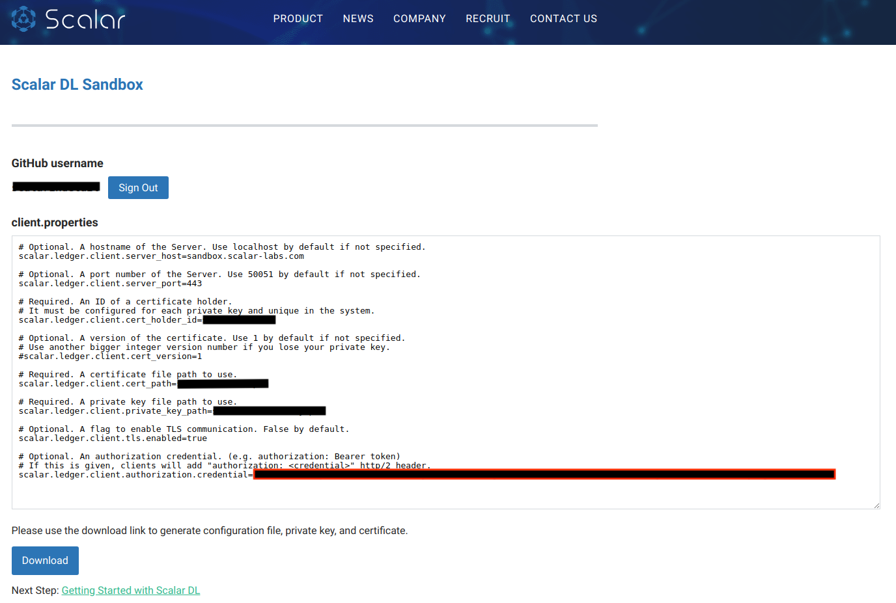

# Apply for using Scalar DL Sandbox

Please follow the steps below:

1. Go to https://scalar-labs.com/sandbox/
2. Click `Sign in Github` button
3. Enter your Github account and password
4. Permit Scalar DL Sandbox to access your email
5. Click `Download` button to download the private key and certificate

Your credential will be displayed in the field `scalar.ledger.client.authorization.credential` of the client.properties.
Like the image below.
